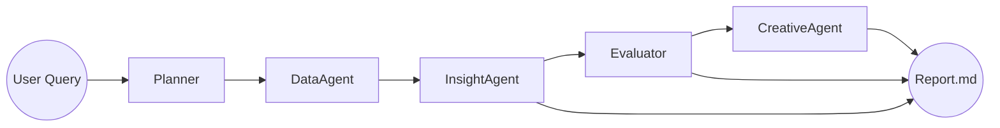

# Agent Graph — Kasparro Agentic FB Performance Analyst  


---

## 🎯 Overview

This document describes the **agent architecture**, **data flow**, and **responsibilities** in the Agentic Facebook Performance Analyst System.

The system goal is to autonomously:

- Diagnose ROAS changes over time  
- Explain the drivers behind performance fluctuations  
- Generate new creative ideas for low-CTR campaigns  

---

## 🧠 High-Level Agent Flow



---

# 🔍 **Agent Responsibilities & I/O Schemas**

---

## 🗺️ **1. Planner Agent**

### **Responsibilities**
- Read raw user query  
- Convert it into structured tasks  
- Determine what the system needs (ROAS analysis / creative generation / date range)  

### **Input**
- Natural language query (string)

### **Output (JSON Schema)**
```json
{
  "objective": "Analyze ROAS drop",
  "steps": [
    "Load data",
    "Summarize key metrics",
    "Identify ROAS movement",
    "Generate hypotheses",
    "Validate hypotheses",
    "Generate creatives"
  ],
  "needs_creatives": true,
  "analysis_window_days": 30
}
```

---

## 📊 **2. Data Agent**

### **Responsibilities**
- Load Cleaned.csv  
- Apply metrics: ROAS, CTR, spend trends  
- Summarize campaign-level performance  
- Compute ROAS/CTR drops  
- Produce a compact summary for the LLM

### **Input**
- Config settings (thresholds, data path)  
- Optional: date range, platform, country filters

### **Output (JSON Summary)**
```json
{
  "overall_metrics": {
    "avg_roas": 2.14,
    "avg_ctr": 0.012
  },
  "roas_trend": [
    { "date": "2024-01-01", "roas": 2.5 },
    { "date": "2024-01-02", "roas": 2.1 }
  ],
  "top_roas_drops": [
    {
      "campaign": "Summer_Sale_01",
      "roas_before": 3.1,
      "roas_after": 1.2,
      "drop_pct": 0.61
    }
  ],
  "low_ctr_campaigns": [
    {
      "campaign": "Winter_Deals_03",
      "ctr": 0.004,
      "creative_message": "Limited time discount!"
    }
  ]
}
```

---

## 💡 **3. Insight Agent**

### **Responsibilities**
- Consume Data Agent summary  
- Generate hypotheses using structured reasoning  
- Look at CTR, spend, impressions, audience, creative  
- Output concise hypotheses

### **Input**
- Data summary JSON  
- System prompt (prompts/insight_prompt.md)

### **Output Schema**
```json
[
  {
    "campaign": "Summer_Sale_01",
    "hypothesis_id": "H1",
    "hypothesis": "Creative fatigue led to ROAS decline",
    "reasoning": "CTR dropped while impressions stayed high",
    "metrics_considered": ["ctr", "impressions", "roas", "spend"],
    "time_window": {
      "before_period": "2024-01-01 to 2024-01-05",
      "after_period": "2024-01-06 to 2024-01-10"
    }
  }
]
```

---

## 🧪 **4. Evaluator Agent**

### **Responsibilities**
- Validate each hypothesis numerically  
- Re-check CTR, spend, ROAS, impressions  
- Assign confidence scores  
- Determine if hypothesis is supported or contradicted  

### **Input**
- Hypotheses list  
- Full metric data (from data_utils)

### **Output Schema**
```json
[
  {
    "hypothesis_id": "H1",
    "validated": true,
    "confidence": 0.78,
    "evidence": {
      "ctr_before": 0.015,
      "ctr_after": 0.008,
      "impressions_change_pct": 0.04,
      "roas_change_pct": -0.61
    },
    "notes": "CTR and ROAS dropped significantly while impressions remained stable."
  }
]
```

---

## 🎨 **5. Creative Improvement Agent**

### **Responsibilities**
- For campaigns with low CTR  
- Analyze creative messaging  
- Generate 3–5 improved ad variants  
- Use angles: urgency, social proof, benefit, scarcity  

### **Input**
- Low CTR campaigns (from Data Agent)  
- Creative message + audience details  
- Prompt template (prompts/creative_prompt.md)

### **Output Schema**
```json
[
  {
    "campaign": "Winter_Deals_03",
    "new_creatives": [
      {
        "headline": "Winter Deals Ending Soon!",
        "primary_text": "Your favorite picks now at 50% OFF. Don't miss out.",
        "cta": "Shop Now",
        "angle": "urgency"
      }
    ]
  }
]
```

---

## 📘 **6. Report Generator**

### **Responsibilities**
- Convert all outputs into a readable human report  
- Include:  
  - ROAS change summary  
  - Top validated insights  
  - Confidence scores  
  - Recommended creative ideas  

### **Final Output**
- `reports/report.md`  
- `reports/insights.json`  
- `reports/creatives.json`  

---

