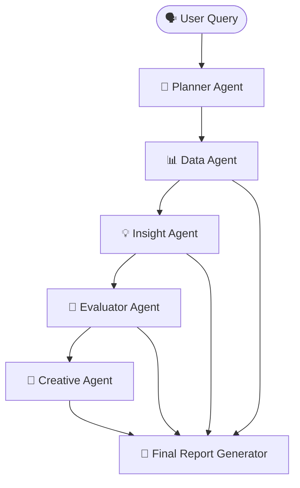

# 🔄 Agent Architecture & Execution Flow  
**Project:** Kasparro Agentic FB Ads Performance Analyst  
**Author:** *<your_name_here>*  

This document provides a complete architectural breakdown of the multi-agent system, explaining the role, input, output, and interactions between the agents. The goal is to create a fully autonomous intelligence pipeline for diagnosing Facebook Ads performance, validating insights, and generating optimized marketing strategies.

---

## 📌 High-Level Agent Flow



---

# 🧩 Agent-Level Responsibilities

## 1️⃣ Planner Agent — Query-to-Execution Designer
**Purpose:** Converts natural user query into structured execution plan (pipeline).  
**Input:** Raw text query from user  
**Output (JSON):**
```json
{
  "objective": "string",
  "campaign_name": "string or list",
  "analysis_window_days": 30,
  "metrics_focus": ["roas", "ctr"],
  "agent_flow": ["data_agent", "insight_agent", "evaluator_agent", "creative_agent"]
}
```
**Key Responsibilities:**
✔ Detect intent (what, why, how, performance)  
✔ Select required agents dynamically  
✔ Extract campaign names, metrics, date filters  

---

## 2️⃣ Data Agent — Performance Metrics Extractor
**Purpose:** Loads dataset, applies filters, and generates structured analytics summary.  
**Input:** Planner output (campaign name, days)  
**Output:**
```json
{
  "campaign_summaries": {...},
  "peak_spend_day": {...},
  "peak_revenue_day": {...},
  "daily_trends": [...],
  "date_range": "2024-01-01 to 2024-01-30"
}
```
**Key Responsibilities:**
✔ Apply campaign and date filtering  
✔ Deliver trend-ready structured insights  
✔ Prevent data overload to LLM  

---

## 3️⃣ Insight Agent — Hypothesis Builder
**Purpose:** Generates data-backed hypotheses explaining performance changes.  
**Input:** Planner objective + DataAgent summary  
**Output:**
```json
[
  {
    "hypothesis_id": "H1",
    "campaign": "Men ComfortMax",
    "hypothesis": "Creative fatigue causing CTR drop",
    "metrics_considered": ["ctr", "impressions"],
    "confidence_level": "high"
  }
]
```
**Key Responsibilities:**
✔ Detect abnormal trends (CTR drop, spend spike)  
✔ Explain reasons behind performance changes  
✔ Convert patterns into hypotheses  

---

## 4️⃣ Evaluator Agent — Hypothesis Validator
**Purpose:** Tests hypotheses using real metrics to confirm or reject.  
**Input:** InsightAgent output + data metrics  
**Output:**
```json
[
  {
    "hypothesis_id": "H1",
    "verdict": "supported",
    "confidence_level": "high",
    "evidence": {...}
  }
]
```
**Key Responsibilities:**
✔ Validate correlations (spend vs ROAS, CTR vs results)  
✔ Determine statistical accuracy  
✔ Assign certainty confidence level  

---

## 5️⃣ Creative Agent — Optimization Strategy Designer
**Purpose:** Converts validated insights into actionable creative strategies.  
**Input:** Validated insights + performance weaknesses  
**Output:**
```json
[
  {
    "campaign": "Men ComfortMax",
    "hypothesis_id": "H1",
    "problem_summary": "CTR dropped due to fatigue",
    "creative_strategy": "Introduce fresh messaging",
    "ad_copy_suggestions": [...],
    "visual_suggestions": [...],
    "audience_targeting_adjustments": [...]
  }
]
```
**Key Responsibilities:**
✔ Propose ad copy variations  
✔ Suggest visual refresh, targeting tweaks  
✔ Align messaging with performance issue  

---

## 6️⃣ Report Generator — Insight Consolidation
**Purpose:** Compile all agent outputs into final marketing report.  
**Input:** Planner, DataAgent, InsightAgent, Evaluator, Creative outputs  
**Output Files:**
| File | Description |
|------|-------------|
| `report.md` | Final business-friendly report |
| `planner_output.json` | Execution pipeline |
| `data_output.json` | Processed metrics summary |
| `insights.json` | Hypothesis results |
| `evaluation.json` | Validation outcomes |
| `creatives.json` | Creative recommendations |

---

## 🚀 Final Conclusion

| Agent | Core Purpose |
|--------|--------------|
| Planner | Understands request & builds execution plan |
| Data Agent | Extracts structured performance metrics |
| Insight Agent | Generates data-backed hypotheses |
| Evaluator Agent | Validates hypotheses with evidence |
| Creative Agent | Converts insights into action strategies |
| Report Generator | Builds final report for marketers |

---

> 💡 This architecture enables **autonomous, insight-driven marketing intelligence**—transforming raw ad data into optimized creative solutions with full explainability.